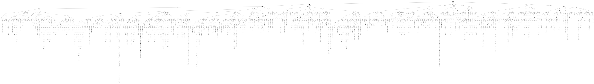
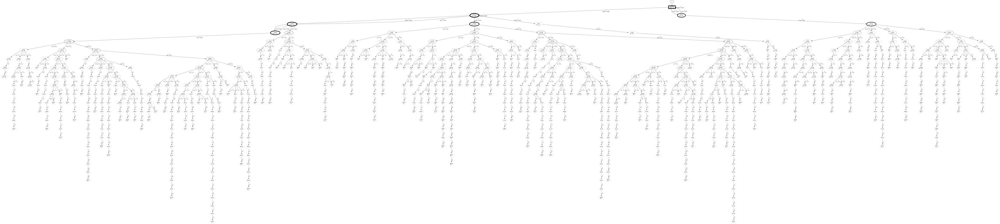
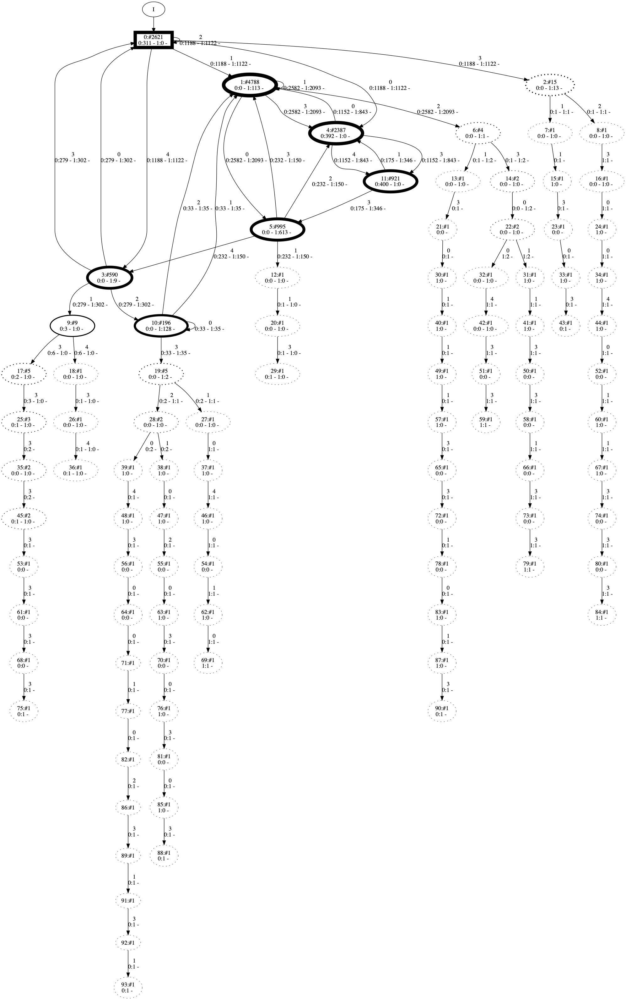

FlexFringe is a tool for learning state machine models from input traces. It is based on the classic red-blue fringe state merging algorithm but uses flexible evaluation functions that can be used to learn a diverse set of models. In this post, we use FlexFringe to learn one of the simplest state machines: a deterministic finite state machine (DFA). In addition, we show the effect of several basic control variables on the learning algorithm, and how to set them on your own data. If this is your first time running FlexFringe, please run the getting_started tutorial first. A DFA is basically a classifier for sequences. Given a sample input file [traces](models/tutorial1.traces "traces") with 2000 traces in Abbadingo format:

```
2000 5
0 9 1 1 1 3 0 0 2 3 1
0 3 1 1 3
0 0
0 13 1 3 0 3 0 1 1 1 1 3 0 3 3
0 9 1 3 0 1 1 3 0 1 3
0 0
1 4 4 2 2 0
…
```

We call Flexfringe using the evidence-driven state-merging evaluation (EDSM) function with the command:

```
./flexfringe tutorial1.traces --ini ini/edsm.ini
```

Resulting in the following output:

```
x1345  x603  x266  x195  x152  x145  m127  m146  m97  m70  m36  m25  m31  m19  m19  m18  m17  m6  m5  x9  m63  m27  m4  m4  m4  m3  m1  m1  no more possible merges
```

As well as a learned model in both .dot and .json format, running:

```
dot -Tpdf tutorial1.traces.ff.final.dot -o tutorial1.png
```
gives


Every step made by the algorithm is output to the console, the meaning of which is explained in the getting_started tutorial. Basically, we want to perform merges with a lot of evidence, i.e., the number next to m should be large. States are added to the model when they are inconsistent with all current states, the number next to an x gives the number of occurrences of an added state.

In the run given above, we are happy with the large sizes of added states and the large merge scores. Several low evidence merges are performed, two of which are based on the evidence from a single state pair. It is possible but not unlikely that these merges are correct. When learning a classifier or predictor, such merges are fine because the difference in (predictive) accuracy is negligible. When using a learned state machine to provide insight into the underlying system, however, performing such a merge can add several edges and states to the model. This can be problematic because they can be used to draw incorrect inferences such as the presence of loops. To overcome this, FlexFringe has a lowerbound parameter, that sets a lowerbound on the allowed merge score. Another option is to define sinks states, but these are to topic of another tutorial.

**Lower Bound.** We add the line

```
lowerbound = 10
```

to edsm.ini, resulting in radically changed algorithm behavior:

```
 x1345  x603  x266  x195  x152  x145  x78  x35  x24  x18  x16  x15  x12  x9  x8  x8  x6  x5  x5  x5  x4  x4  x4  x4  x3  x3  x3  x3  x3  x3  x3  x2  x2  x2  x2  x2  x2  x2  x2  x2  x2  x2  x2  x2  x2  x2  x2  x2  x2  x2  x2  x2  x2  x2  x2  x2  x2  x1  x1  x1  x1  x1  x1  x1  x1  x1  x1  x1  x1  x1  x1  x1  x1  x1  x1  x1  x1  x1  x1  x1  x1  x1  x1  x1  x1  x1  x1  x1  x1  x1  x1  x1  x1  x1  x1  x1  x1  x1  x1  x1  x1  x1  x1  x1  x1  x1  x1  x1  x1  x1  x1  x1  x1  x1  x1  x1  x1  x1  x1  x1  x1  x1  x1  x1  x1  x1  x1  x1  x1  x1  x1  x1  x1  x1  x1  x1  x1  x1  x1  x1  x1  x1  x1  x1  x1  x1  x1  x1  x1  x1  x1  x1  x1  x1  x1  x1  x1  x1  x1  x1  x1  x1  x1  x1  x1  x1  x1  x1  x1  x1  x1  x1  x1  x1  x1  x1  x1  x1  x1  x1  x1  x1  x1  x1  x1  x1  x1  x1  x1  x1  x1  x1  x1  x1  x1  x1  x1  x1  x1  x1  x1  x1  x1  x1  x1  x1  x1  x1  x1  x1  x1  x1  x1  x1  x1  x1  x1  x1  x1  x1  x1  x1  x1  x1  x1  x1  x1  x1  x1  x1  x1  x1  x1  x1  x1  x1  x1  m127  x3  x3  x3  x3  x3  x3  x2  x2  x2  x2  x2  x2  x2  x2  x2  x1  x1  x1  x1  x1  x1  x1  x1  x1  x1  x1  x1  x1  x1  x1  x1  x1  x1  x1  x1  x1  x1  x1  x1  x1  x1  x1  x1  x1  x1  x1  x1  x1  x1  x1  x1  x1  x1  x1  x1  x1  x1  x1  x1  x1  x1  x1  x1  x1  x1  x1  x1  x1  x1  x1  x1  x1  x1  x1  x1  x1  x1  x1  x1  x1  x1  x1  x1  x1  x1  x1  x1  x1  x1  x1  x1  x1  x1  x1  x1  x1  x1  x1  x1  x1  x1  x1  x1  x1  x1  x1  x1  x1  x1  x1  x1  x1  x1  x1  x1  x1  x1  x1  x1  x1  x1  x1  x1  x1  x1  x1  x1  x1  x1  x1  x1  x1  x1  x1  x1  x1  x1  x1  x1  x1  x1  x1  x1  x1  x1  x1  x1  x1  x1  x1  x1  x1  x1  x1  x1  x1  x1  x1  x1  x1  x1  x1  x1  x1  x1  x1  x1  x1  x1  x1  x1  x1  x1  x1  x1  x1  x1  x1  x1  x1  x1  x1  m146  x3  x3  x2  x2  x2  x2  x2  x2  x1  x1  x1  x1  x1  x1  x1  x1  x1  x1  x1  x1  x1  x1  x1  x1  x1  x1  x1  x1  x1  x1  x1  x1  x1  x1  x1  x1  x1  x1  x1  x1  x1  x1  x1  x1  x1  x1  x1  x1  x1  x1  x1  x1  x1  x1  x1  x1  x1  x1  x1  x1  x1  x1  x1  x1  x1  x1  x1  x1  x1  x1  x1  x1  x1  x1  x1  x1  x1  x1  x1  x1  x1  x1  x1  x1  x1  x1  x1  x1  x1  x1  x1  x1  x1  x1  x1  x1  x1  x1  x1  x1  x1  x1  x1  x1  x1  x1  x1  x1  x1  x1  x1  x1  x1  x1  x1  x1  x1  x1  x1  x1  x1  x1  x1  x1  x1  x1  x1  x1  x1  x1  x1  x1  x1  x1  x1  x1  x1  x1  x1  x1  x1  x1  x1  x1  m97  x1  x1  x1  x1  x1  x1  x1  x1  x1  x1  x1  x1  x1  x1  x1  x1  x1  x1  x1  m70  x2  x1  x1  x1  x1  x1  x1  x1  x1  x1  x1  x1  x1  x1  x1  m36  x1  x1  x1  x1  x1  x1  x1  x1  x1  x1  x1  m35  x1  x1  x1  x1  m20  x1  x1  x1  x1  x1  x1  m18  x1
```

So, what is going on? It might look like something is wrong, but this is the intended effect of using a lowerbound value. Without a lowerbound, any state-pair that is consistent can be merged. With a lowerbound l, the state-pair in addition needs to achieve a merge score of at least l. In EDSM, the merge score is simply the number of performed merges, so at least 10 merges need to be performed during the determinization process. Let us have a look at how the state machine structure progresses during the EDSM run (red states in solid lines, blue states in dashed lines) :


It starts with a root (solid) and 3 children (dashed). The solid states are identified and its children are options for merges. The algorithm adds one of the dashed states to the solid core:


And several more, until the point where it would have performed a merge before we added the lowerbound constraint:


At this point it keeps adding states to the core, learning new states in the state machine model, even with single occurrences (x1 in the algorithm run output), essentially forming a tree:


Until finally it performs the merges it perfomed at the start of the run without the lowerbound constraint (m127, m146, m97), resulting in:


This gives essentially a tree, with some merges close to the root. The FlexFringe algorithm added all those states to the core because these failed the lowerbound criterion, i.e., they could not be merged consistently with any other state and obtain a merge score of at least 10. In the default setting, whenever the algorithm finds a (blue) state that cannot be merged with any other (red) state, it adds that state to the core (coloring it red). This behavior can be changed by setting the extend parameter to false.

**Extend.** We add the line

```
extend = 0
```

to edsm.ini, resulting in:

```
m64  x1475  m140  x1111  m166  x565  m33  x490  m24  m31  m17  m18  x299  m75  x236  m59  x184  m21  m20  x134  m27  x15  x13  x12  x9  x8  x5  x5  x3  x3  x3  x2  x2  x2  x2  x2  x2  x2  x2  x2  x2  x1  x1  x1  x1  x1  x1  x1  x1  x1  x1  x1  x1  x1  x1  x1  x1  x1  x1  x1  x1  x1  x1  x1  x1  x1  x1  x1  x1  x1  x1  x1  x1  x1  x1  x1  x1  x1  x1  x1  x1  x1  x1  x1  x1  x1  x1  x1  x1  x1  x1  x1  x1  x1  x1  x1  x1  x1  x1  x1  x1  x1  x1  x1  x1  x1  x1  x1  x1  x1  x1  x1  x1  x1  x1  x1  x1  x1  x1  x1  x1  x1  x1  x1  x1  x1  x1  x1  x1  x1  x1  x1  x1  x1  x1  x1  x1  x1 
 ```
FlexFringe performs a merge immediately:

and results in a small model where states that fail the lowerbound constraint are left as subtrees:


You may also notice that the algorithm starts with several extend actions before perfoming merges. Let us first investigate how to modify this initial behavior. In images, the initial part of the run looks as follows:


All input traces go through the root, resulting in high initial ocurrences and evidence values. Later in the process, the merge scores become smaller and smaller because the lower levels of model are reached by fewer and fewer input traces. When learning models, it is important to monitor the merge scores and make sure they do not drop become too small (meaning merges are performed based on very little evidence). This can be controlled using the lowerbound parameter and by using sink states. In the run above, the final merge scores are low and we might consider putting a lowerbound of 10 to avoid making those merges. We discuss these and other parameter settings in another post. The early large merge scores give us confidence however that most of the identified states in the learned state machine are correct:


The root state is indicated by the rectangle. The information printed in a state, i.e:

```
1:#4826
0:0 - 1:116 -
```

means that this is state number 1 (a simple identifier), it occurs 4826 times in total in the training data (a state can occur multiple times in one trace), 0 negative traces (0:0) end in this state, and 116 positive traces end in it (1:116). For a transition, i.e.:

```
0
0:2604 - 1:2106 -
```

The first symbol is the label of the transition (the event triggering this transition to fire), it occurs 2604 times in negative traces, and 2106 times in positive traces. Note that the information under the first line is printed by the evaluation function, thus using a different function will likely result in different information being printed. We also provide a python notebook that can be used to run traces through the learned model (using the .json file as input) for instance to compute the accuracy on a test set. This will be described in a later tutorial. For now, it is most important to understand the basic steps, including consistency checks, and the output of the learning algorithm. Here we show several steps of FlexFringe on the tutorial input file, resulting in smaller and smaller models. The dashed states are not yet identified parts of the prefix tree, the solid parts are the identified ones:









If you use FlexFringe in your research paper, please consider citing the following reference:

> @inproceedings{verwer2017flexfringe,
>  title={Flexfringe: a passive automaton learning package},
>  author={Verwer, Sicco and Hammerschmidt, Christian A},
>  booktitle={2017 IEEE International Conference on Software Maintenance and Evolution (ICSME)},
>  pages={638--642},
>  year={2017},
>  organization={IEEE}
>}
