FlexFringe is a tool for learning state machine models from input traces. It is based on the classic red-blue fringe state merging algorithm but uses flexible evaluation functions that can be used to learn a diverse set of models. In this post, we use FlexFringe to learn a probabilistic deterministic finite state automaton (PDFA). A PDFA is a probabilstic model similar to a hidden Markov model (HMM), but with a unique starting state and state transitions that are triggered by the event occurrences.

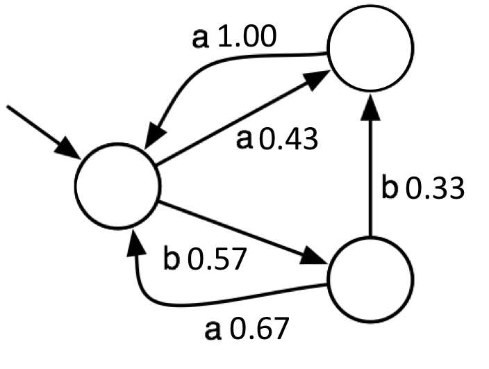

A PDFA is a generative model for distributions over sequences. It has a unique starting state (arrow pointing to the left-most state). From there it generates symbols/events according to the associated probabilities. For instance, in the model above, it generates a with probability 0.43 or b with probability 0.57. Simultaneously, it moves the current state of the system to the next one, as indicated by the transition arrows, and continues the generating process. In this way, it generates sequences. Multiplying the individual probabilites then gives the sequence probability. For instance, aabba has probability 0.43 * 1.0 * 0.57 * 0.44 * 0.33 * 1.00 = 0.036... This models distributions over sequences of equal length (the sum of all probabilities assigned to sequences of the same length equals 1). Optionally, the states can contain stopping/final probabilities in addition to the transition probabilities. When it does, a PDFA models a distribution over the set of all sequences. Note that the model above does not contain a b transition for the state reached by a. This transition has a probability of 0 and is therefore not drawn.

A PDFA looks similar to a Markov chain but can model a much greater range of distributions because the same symbol occurs in multiple place in the model. In a Markov chain, an event occurence triggers a transition to a unique state, in a PDFA there are multiple possible transitions and which one is triggered depends on what occured before (which state the process is in). PDFAs are therefore called models with hidden or latent state. They are similar to HMMs but a PDFA potentially requires exponentially many more states than an equivalent HMM do to its deterministic nature. In return for this loss in power, a PDFA is much easier to interpret because there exists exactly one state path for any given input trace.

We use the same input file as the getting started tutorial [traces](models/tutorial1.traces "traces"):

```
2000 5
0 9 1 1 1 3 0 0 2 3 1
0 3 1 1 3
0 0
0 13 1 3 0 3 0 1 1 1 1 3 0 3 3
0 9 1 3 0 1 1 3 0 1 3
0 0
1 4 4 2 2 0
…
```

We run Flexfringe using the Alergia evaluation function. Alergia is a well-known algorithm that merges states in the initial prefix tree using a statistical test based on the Hoeffding bound. Essentially, the distributions for every pair of merged states is required to be not significantly different. Flexfringe includes some additional tricks that make this test more powerful. Note that altough the input file contains type information for every input sequence, the algorithm ignores this and only uses the occurrence counts to construct a model. In FlexFringe, it is of course possible to use both these information sources during the merging process, we will explain in a later tutorial how.

```
./flexfringe tutorial1.traces --ini ini/alergia.ini
```

Results in the following output:

....

```
 x1345  x603  x570  x266  x233  x195  x145  x121  x105  m252  x160  x103  m281  x66  m235  m139  m112  m76  m80  x225  x63  m72  m67  m77  m67  m67  m64  m62  m60  m57  m53  m53  m51  m49  m48  m53  m44  m43  m39  m37  m29  m22  m21  m22  m14  m13  m12  m9  m9  m5  m5  m1  no more possible merges
```

As well as a learned model in both .dot and .json format, running:

```
dot -Tpng tutorial1.traces.ff.final.dot -o tutorial_alergia.png
```
gives


Like EDSM, see the first tutorial, an x means that the algorithm identifies a new state in the model. The algorithm tried all possible merges between this state and the existing ones, and all failed to meet the consistency criterion set in the Alergia evaluation function:

```c++
/* ALERGIA, consistency based on Hoeffding bound, only uses positive (type=1) data, pools infrequent counts */
bool alergia::consistent(state_merger *merger, apta_node* left, apta_node* right){
    alergia_data* l = (alergia_data*) left->data;
    alergia_data* r = (alergia_data*) right->data;
    
    return data_consistent(l, r);
};
```

Where data_consistent() is a somewhat complicated routine that tests for consistency between the left and right states. It collects the frequencies of symbols, and optionally final/ending counts, and calls the Alergia consistecy check for each pair of the same occurrence in the left and right states:

```c++
bool alergia::alergia_consistency(double right_count, double left_count, double right_total, double left_total){
    if(left_count >= SYMBOL_COUNT && right_count >= SYMBOL_COUNT){
        double bound = (1.0 / sqrt(left_total) + 1.0 / sqrt(right_total));
        bound = bound * sqrt(0.5 * log(2.0 / CHECK_PARAMETER));

        double gamma = ((left_count + CORRECTION) / left_total) - ((right_count + CORRECTION) / right_total);

        if(gamma > bound) return false;
        if(-gamma > bound) return false;
    }
    return true;
};
```

Here right_count (left_count) is the count from the right (left) state and the totals are the total number of occurrences in the right (left) state. The check is the Hoeffding bound check from the original Alergia algorithm. The CHECK_PARAMETER is a user-defined parameter for the significance of this statistical test, the default is 0.05 and it can be set using the extrapar parameter. Setting this much smaller (0.05) creates less inconsistencies and therefore a smaller model:


Setting extrapar larger (0.5) gives more inconsistencies and therefore a larger model:


We advice setting the extrapar parameter using trial-and-error. In this tutorial, we can cheat a bit because we know that there exists a succint model that seperates positive from negative traces. Although this additional information is not used by the state merging process using the Alergia heuristic, we can test whether a resulting model provides good seperation. The states that the positive and negative traces end in are indicated in the .dot model for every state after the fin: statement. In this case, we would argue the smaller model is better because it provides better seperation (only 42 mistakes in the two left states) using less states.

**Pooling**

The code contains an additional trick that greatly influences the performed checks. The flexfringe Alergia implementation performs symbol pooling. The core idea of this is to use the absence, or low frequency, of symbols as important information to prevent merges from happening. This may be especially important in the software domain, where the absence of symbols is important when determining the state space. For instance:

symbol | 1 | 2 | 3 | 4 | 5 |
--- | --- | --- | --- | --- | --- |
count left | 0 | 0 | 15 | 5 | 5 |
count right | 5 | 5 | 15 | 0 | 0 |

would in a normal Alergia check be considered consistent:

```
5 / 25 - 0 = 0.20 < (1/sqrt(25) + 1/sqrt(25)) * sqrt(0.5 * ln(2.0 / 0.01)) = 0.246...
```

even though two out of the three symbols that orrur in the left/right node do not occur in the other. To partially overcome this, we pool the distribution bins of low frequency (in this case 0) counts. Giving us:

symbol | 1,2 | 3 | 4,5 |
--- | --- | --- | --- |
count left | 0 | 15 | 10 |
count right | 10 | 15 | 0 |

and a significant difference:

```
10 / 25 - 0 = 0.40 > 0.246...
```

This is what the somewhat complex data_consistent routine computes on-the-fly, depending on the current frqequency counts in the left and right nodes. Three parameters that control this process are the state_count, symbol_count, and correction parameters. The state_count parameter (default 50) only performs statistical checks such as the alergia consistency test for states that occur at least state_count times. If either the left or the right state occur less frequently, the consistency check simply returns true. The symbol_count parameter as a lower bound on a symbol's frequency. When the count is smaller in the right or left state, its bin is pooled and its counts are added to the right or left pool, respectively. Intuitively, the higher this value, the more inconsistencies Alergia can find. However, set it too large and counts that indicated a significant difference get pooled and the difference disappears. As this really depends on the data at hand, and its distribution and alphabet size etc., setting this parameter is a matter of trail-and-error (default 25). The final parameter that influences this process is the correction parameter (default 0), which simply adds correction counts to all occurrence counts after pooling. This is effect performs a type of Laplace smoothing on all counts at the time of performing the consistency test.


This code first casts the data type in the states (apta_node*) to count_data, giving access to the data and functions required for the test, and then checks a pair of merged states during determinization, whether one is positive (l->pos_final() != 0) and the other negative (r->neg_final() != 0). If so, the resulting model is considered inconsistent because there exists a state that both a positive and a negative trace end in. The method sets found_inconsistency to true and returns false. If not, the method returns true, indicating that the pair of states can be merged. This method is called for ever pair of states that are merged during determinization.

The number next to the x is the number of occurrences of the extended state. It also prints the performed merges m. Every m means a merge between an identified and not yet identified state has been performed, identifying a new transition in the final model. The number next to the m is the score of the EDSM evaluation function:

```c++
void evidence_driven::update_score(state_merger *merger, apta_node* left, apta_node* right){
    edsm_data* l = (edsm_data*) left->data;
    edsm_data* r = (edsm_data*) right->data;

    if(l->pos_final() > 0 && r->pos_final() > 0) num_pos += 1;
    if(l->neg_final() > 0 && r->neg_final() > 0) num_neg += 1;
};
```

This counts, over all pairs of states merged during determinization, the number of merdeg positive-positive and negative-negative state pairs. The method adds 1 to a counter for all such merges and returns the total count in the compute_score function:

```c++
double evidence_driven::compute_score(state_merger *merger, apta_node* left, apta_node* right){
    return num_pos + num_neg;
};
```

Every pair of positive-positive and negative-negative states is considered evidence that the merge is correct. The core state merging algorithm is greedy and in every iteration tries all possible merges between identified states and their children. From all consistent merges, it then selects and performs the one with largest evidence score. When there are no consistent merges, it extends the identified states by adding the not yet identified state with the largest number of occurences. The evidence (and occurrence) values are larger at the start of the merging process because the algorithms initially perform merges at the root of a prefix tree:

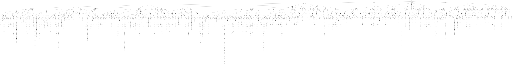

All input traces go through the root, resulting in high initial ocurrences and evidence values. Later in the process, the merge scores become smaller and smaller because the lower levels of model are reached by fewer and fewer input traces. When learning models, it is important to monitor the merge scores and make sure they do not drop become too small (meaning merges are performed based on very little evidence). This can be controlled using the lowerbound parameter and by using sink states. In the run above, the final merge scores are low and we might consider putting a lowerbound of 10 to avoid making those merges. We discuss these and other parameter settings in another post. The early large merge scores give us confidence however that most of the identified states in the learned state machine are correct:

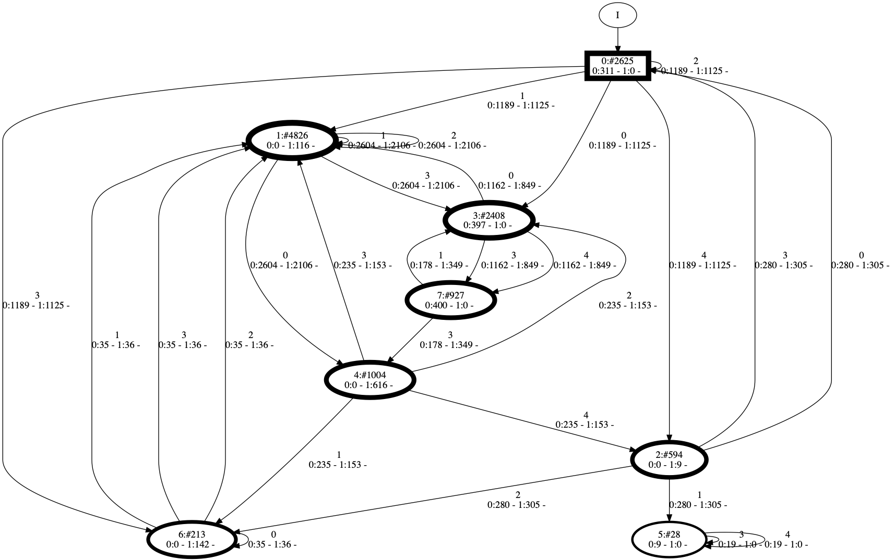

The root state is indicated by the rectangle. The information printed in a state, i.e:

```
1:#4826
0:0 - 1:116 -
```

means that this is state number 1 (a simple identifier), it occurs 4826 times in total in the training data (a state can occur multiple times in one trace), 0 negative traces (0:0) end in this state, and 116 positive traces end in it (1:116). For a transition, i.e.:

```
0
0:2604 - 1:2106 -
```

The first symbol is the label of the transition (the event triggering this transition to fire), it occurs 2604 times in negative traces, and 2106 times in positive traces. Note that the information under the first line is printed by the evaluation function, thus using a different function will likely result in different information being printed. We also provide a python notebook that can be used to run traces through the learned model (using the .json file as input) for instance to compute the accuracy on a test set. This will be described in a later tutorial. For now, it is most important to understand the basic steps, including consistency checks, and the output of the learning algorithm. Here we show several steps of FlexFringe on the tutorial input file, resulting in smaller and smaller models. The dashed states are not yet identified parts of the prefix tree, the solid parts are the identified ones:

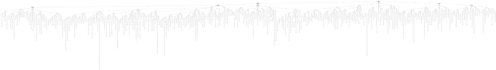
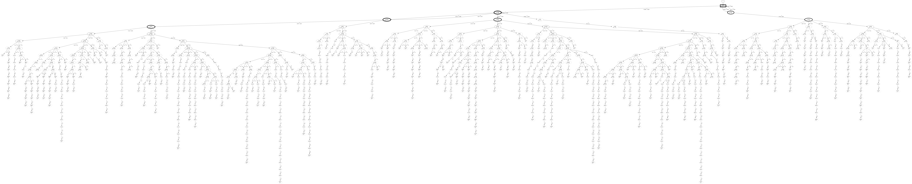
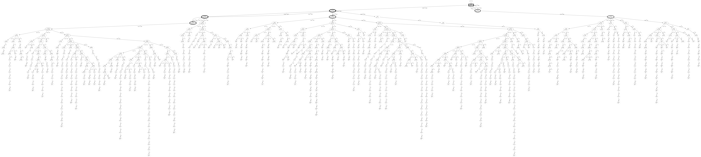
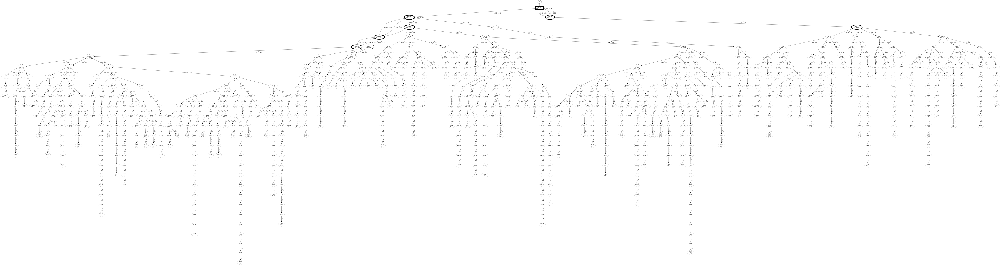
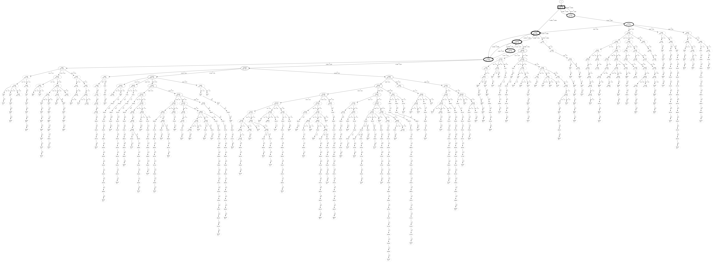
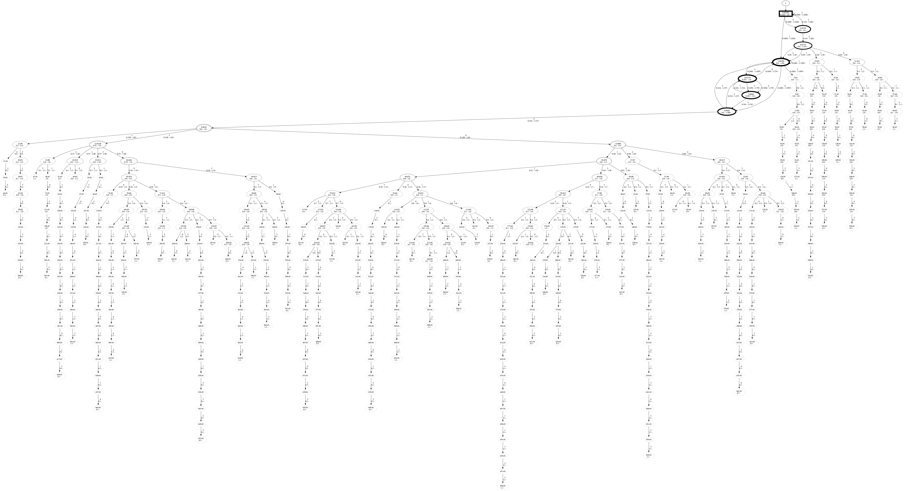
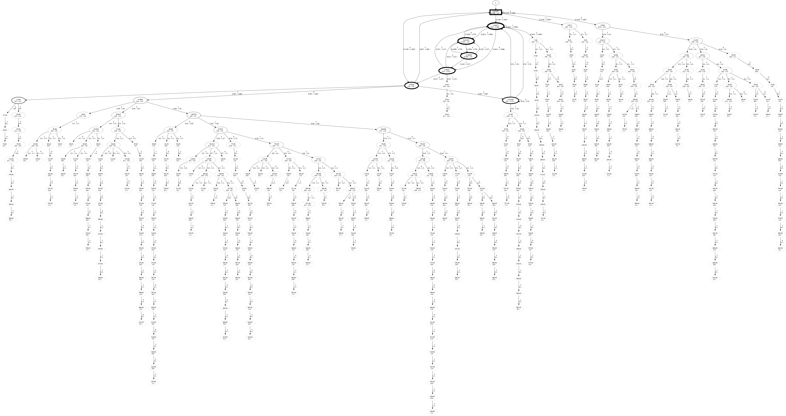

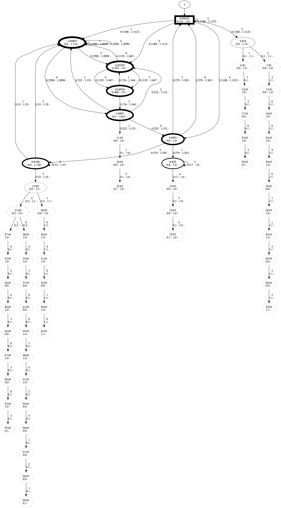

If you use FlexFringe in your research paper, please consider citing the following reference:

> @inproceedings{verwer2017flexfringe,
>  title={Flexfringe: a passive automaton learning package},
>  author={Verwer, Sicco and Hammerschmidt, Christian A},
>  booktitle={2017 IEEE International Conference on Software Maintenance and Evolution (ICSME)},
>  pages={638--642},
>  year={2017},
>  organization={IEEE}
>}


